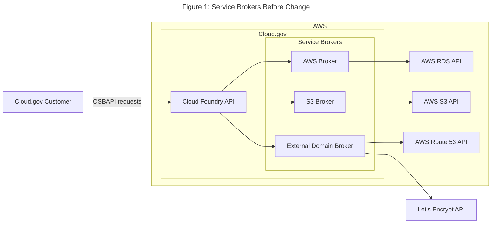
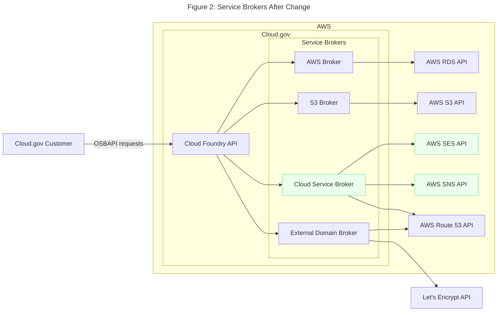
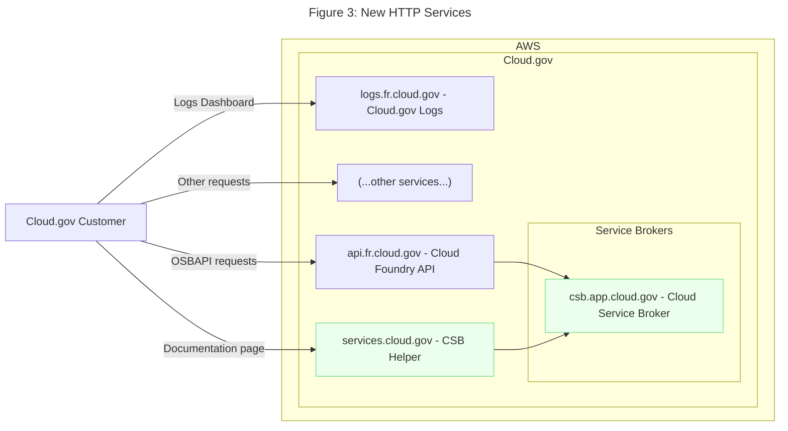

# Diagrams

## Service Brokers, Before

The current state of service brokers on Cloud.gov. Open Service Broker API requests are sent to the Cloud Foundry API (CAPI). Service brokers are registered with CAPI to handle requests for particular service offerings. CAPI forwards the request to the registered broker, which communicates with AWS to fulfill the request. (For brevity, not all service brokers and AWS APIs currently in use are depicted.)

## Service Brokers, After

This change adds a new broker, the Cloud Service Broker (CSB). The CSB uses OpenTofu, an open-source fork of Terraform, to deploy services. The first new service deployed using the CSB will be AWS Simple Email Service (SES).

## New HTTP Services

New HTTP services introduced by the Cloud Service Broker SCR are in green. (For brevity, not all existing Cloud.gov web services are depicted.)

- The **CSB** fulfills provisioning and binding requests for certain service offerings.
- The **Documentation Proxy** is a server that displays documentation for service offerings maintained by the CSB. The CSB exposes a documentation endpoint, `docs/`. When a user makes a request to this service, the service GETs the `docs/` page and returns it to the user with some visual changes.
- The **Service Updater** regularly updates customer service instances so the instances stay up to date with the latest plans offered by the CSB. It may accept administrative HTTPS requests, but only on an internal domain.

